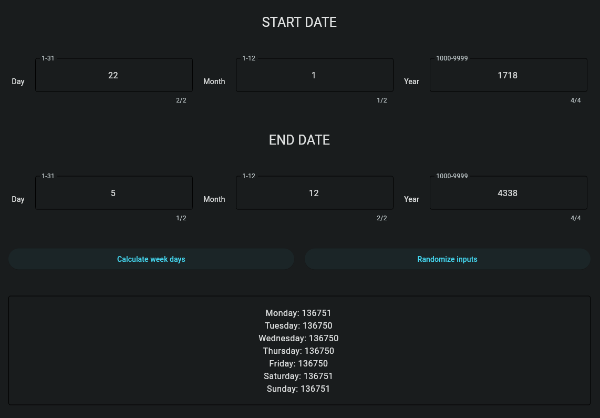
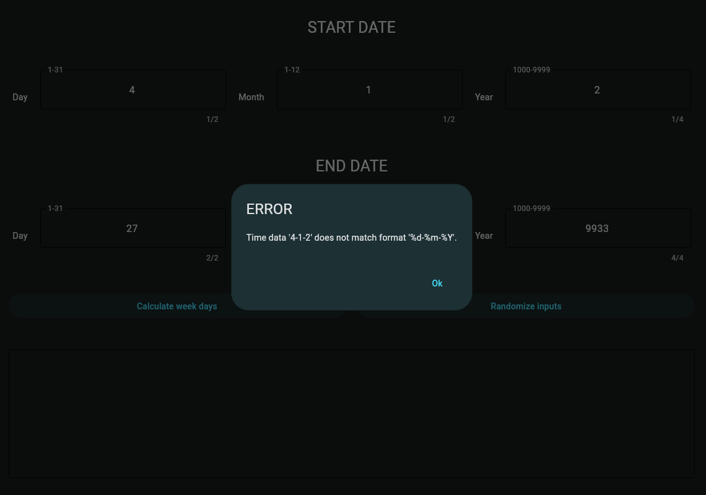

<h1 style="display: flex; justify-content: center">Week Days Counter</h1>

---

## Overview

A graphical application interface built using the Tkinter library in Python.
It provides a convenient way to calculate the number of weekdays between two specified dates.
The application features an intuitive design with input fields for the start and end dates,
along with buttons to perform calculations and randomize date entries.

## Features

1. ***Date Calculation:*** The application uses Python's `datetime` module to accurately calculate weekdays between
   the specified start and end dates. It accounts for date formatting and ensures the validity of the entered dates.
2. ***Randomize Entries:*** The app includes a feature to randomize date entries, making it easy for users to quickly
   test the functionality without manually entering dates. This is particularly useful for testing different scenarios.
3. ***User-Friendly Interface:*** The GUI is designed to be user-friendly, with clear labels, input fields,
   and buttons. Error messages are displayed in case of invalid date inputs, providing feedback to the user.
4. ***Result Display:*** The calculated weekdays are displayed in a text widget, showing the count for each day
   (Monday to Sunday). The result display is read-only to prevent user modification.

## Installation & Launching

```sh
pip install -r requirements.txt
```

```sh
python3 app.py
```

## PyInstaller Package Creation

```sh
pyinstaller --noconfirm --onefile --windowed --name "Week Days Counter" app.py
```

## Usage Examples

<table>
    <tr>
        <th colspan="2">Normal usage</th>
    </tr>
    <tr>
        <td>
          <div style="text-align:center; border-radius: 10px; overflow: hidden; margin: 0 auto;">
            
          </div>
        </td>
        <td>
          <div style="text-align:center; border-radius: 10px; overflow: hidden; margin: 0 auto;">
            
          </div>
        </td>
    </tr>
    <tr>
        <th colspan="2">Error handling</th>
    </tr>
    <tr>
        <td>
          <div style="text-align:center; border-radius: 10px; overflow: hidden; margin: 0 auto;">
            
          </div>
        </td>
        <td>
          <div style="text-align:center; border-radius: 10px; overflow: hidden; margin: 0 auto;">
            
          </div>
        </td>
    </tr>
</table>

[//]: # (![invalid_day_value.png]&#40;app_example%2Finvalid_day_value.png&#41;)